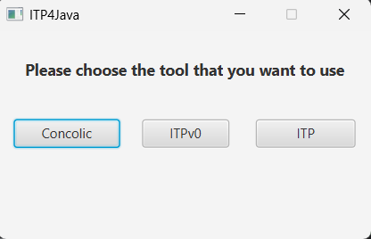
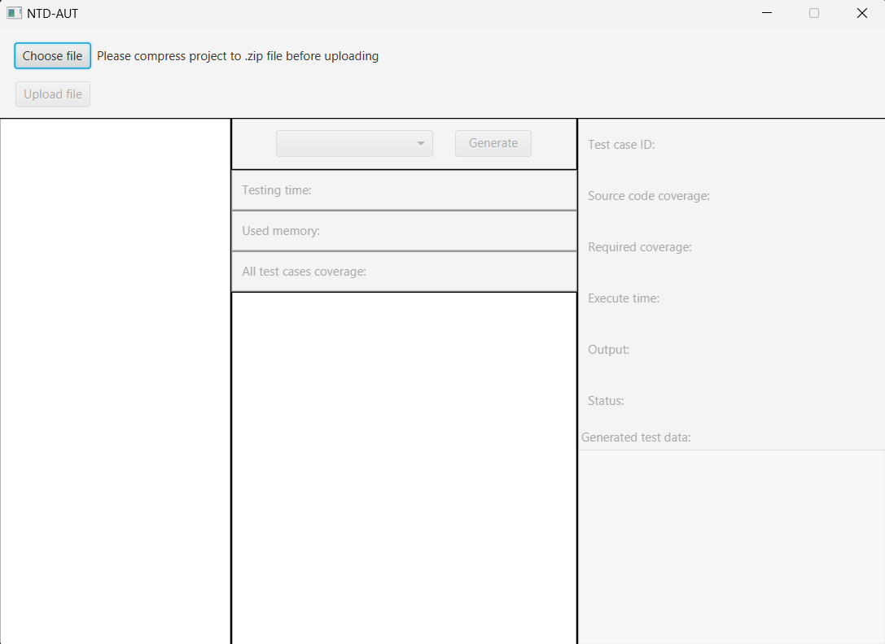
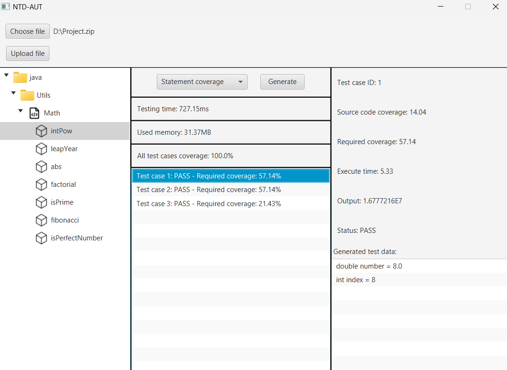

# NTD-AUT: A Non-Test Driver Concolic-Based Unit Testing Method for Java Projects
## USER MANUAL
### Required environment
- Our implementation has been tested on the Windows, Intel®Core™i7-1165G7 CPU @ 2.80GHz, 16GBs RAM memory.
- IntelliJ IDEA, which is available [here](https://www.jetbrains.com/idea/download/)
- [Java 11 SDK](https://www.oracle.com/java/technologies/javase-jdk11-downloads.html)
- [Download JavaFX SDK (Version: 17.0.10, Type: SDK)](https://gluonhq.com/products/javafx/)
- [z3 solver (Version >= 4.12.2)](https://github.com/Z3Prover/z3)
  - Extract the downloaded file
  - Add the path to the `bin` folder to the system environment variable `PATH` or `Path`
## How to Run?
1. Clone and Open the project in IntelliJ IDEA
2. Add JavaFX SDK to the project (File -> Project Structure -> Libraries -> Add -> Java -> Select the lib folder of JavaFX SDK)
3. Edit Configuration 
   - New Configuration -> Application
   - Main class: `gui.Main`
   - Modify options -> Add VM options: `--module-path <path-to-lib-folder-of-javafx-sdk> --add-modules javafx.controls,javafx.fxml` (TODO: Change the path to your JavaFX SDK lib folder)
4. Run the project, the tool will ask you to choose between two options:
   - **Option 1**: NTD method
   - **Option 2**: Traditional concolic method\

5. After choosing the method, the main screen looks like this:

6. Upload the project by clicking the `Choose file` button, then select the project folder.\
Note:
   - We have provided some sample projects in the `sample` folder.
   - The project should be compressed into a zip file.
   - The project should contain the `java` folder, which contains the source code.
7. After the project is uploaded, choose the unit and then choose the coverage criteria.
8. Click the `Generate` button to start the testing process. The result will be displayed and you can click on each test case to see the details as well as below:

